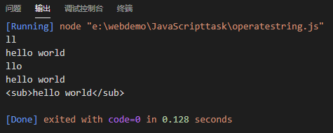

# 此文件为校宝在线JS学习记录

### 字符串学习：

sub、substr、substring的区别：

```javascript
//测试代码
let string = "hello world";
console.log(string.substring(2, 4));
console.log(string.substring(0));
console.log(string.substr(2, 4));
console.log(string.substr(0));
console.log(string.sub());
```

sub()方法用于把字符串显示为下标，sub会给字符串外层加入<sub>标签，substr() 方法可在字符串中抽取从 *start* 下标开始的指定数目的字符，substring() 方法用于提取字符串中介于两个指定下标之间的字符。substr截取字符串时包含末尾下标，而substring不包含。当都是传入一个参数时输出结果相同。

测试结果：

不错的正则表达式学习网站：https://codejiaonang.com/#/course/regex_chapter1/0/0

### 数组操作：

**indexOf()**方法可返回某个指定的字符串值在字符串中首次出现的位置。如果没有找到匹配的字符串则返回 -1。同时数组也有indexOf方法，当数组里存在某个值时，会返回index，否则返回-1。严格说indexOf用的比较方法是===。

**find()**方法返回通过测试（函数内判断）的数组的第一个元素的值。find() 方法为数组中的每个元素都调用一次函数执行：当数组中的元素在测试条件时返回 *true* 时, find() 返回符合条件的元素，之后的值不会再调用执行函数。如果没有符合条件的元素返回 undefined。

**filter()**方法，会根据在方法中传入的判断条件返回符合条件的所有元素。

**forEach()**方法用于调用数组的每个元素，并将元素传递给回调函数。

**map()**方法返回一个新数组，数组中的元素为原始数组元素调用函数处理后的值。map() 方法按照原始数组元素顺序依次处理元素。

map()与filter()方法的区别在于，map只是对数组中的值进行判断，然后返回true或者false存在数组中，filter会将符合判断条件的元素放入新的数组中。

**reduce()**方法的功能就是一个累加器，数组中的每个值（从左到右）开始缩减。先定义一个加法函数，然后将此函数传入reduce即可。

数组还有splice()，sort()等方法。

