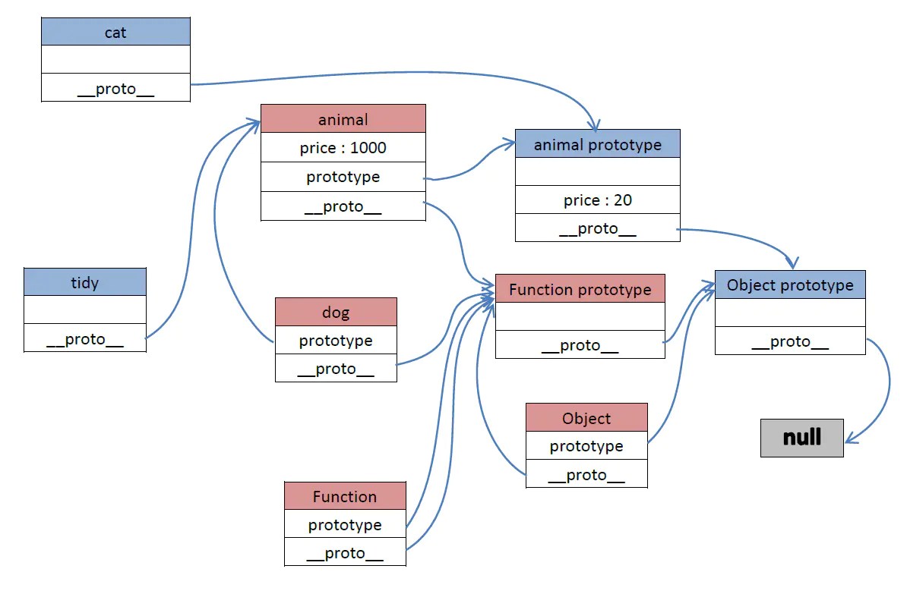

# 此文件为校宝在线JS学习记录

### 字符串学习：

sub、substr、substring的区别：

```javascript
//测试代码
let string = "hello world";
console.log(string.substring(2, 4));
console.log(string.substring(0));
console.log(string.substr(2, 4));
console.log(string.substr(0));
console.log(string.sub());
```

sub()方法用于把字符串显示为下标，sub会给字符串外层加入<sub>标签，substr() 方法可在字符串中抽取从 *start* 下标开始的指定数目的字符，substring() 方法用于提取字符串中介于两个指定下标之间的字符。substr截取字符串时包含末尾下标，而substring不包含。当都是传入一个参数时输出结果相同。

测试结果：

不错的正则表达式学习网站：https://codejiaonang.com/#/course/regex_chapter1/0/0

### 数组操作：

**indexOf()** 方法可返回某个指定的字符串值在字符串中首次出现的位置。如果没有找到匹配的字符串则返回 -1。同时数组也有indexOf方法，当数组里存在某个值时，会返回index，否则返回-1。严格说indexOf用的比较方法是===。

**find()** 方法返回通过测试（函数内判断）的数组的第一个元素的值。find() 方法为数组中的每个元素都调用一次函数执行：当数组中的元素在测试条件时返回 *true* 时, find() 返回符合条件的元素，之后的值不会再调用执行函数。如果没有符合条件的元素返回 undefined。

**filter()** 方法，会根据在方法中传入的判断条件返回符合条件的所有元素。

**forEach()** 方法用于调用数组的每个元素，并将元素传递给回调函数。

**map()** 方法返回一个新数组，数组中的元素为原始数组元素调用函数处理后的值。map() 方法按照原始数组元素顺序依次处理元素。

map()与filter()方法的区别在于，map只是对数组中的值进行判断，然后返回true或者false存在数组中，filter会将符合判断条件的元素放入新的数组中。

**reduce()** 方法的功能就是一个累加器，数组中的每个值（从左到右）开始缩减。先定义一个加法函数，然后将此函数传入reduce即可。

数组还有splice()，sort()等方法。

### 对象学习：

值类型赋值，不会互相影响，但是对象相当于开辟了一个内存空间，在传值时是把地址传给另一个对象，可以用JSON字符串转换赋值的方法把对象之间的联系断开。在对象引用赋值之后，如果将对象置空，那就改变了对象的地址了，也不互相影响了。

#### JS的原型链：

在JS里，继承机制是原型继承。继承的起点是 **对象的原型（Object prototype）**

一切皆为对象，只要是对象，就会有 **proto** 属性，该属性存储了指向其构造的指针。函数必然有 **prototype** 和两个  **\_proto\_** 属性，所有的函数(包括自定义函数)都是Function实例的对象。对象必然有\_proto\_属性，但不一定有prototype；实例的对象通过\_proto\_属性连接到构造函数的prototype属性上。而原型链就是从这两者的关系开始一层一层往下找的关系。

当调取一个对象的属性时，会先在本身查找，若无，就根据 **\_proto\_** 找到构造原型，若无，继续往上找。最后会到达顶层Object prototype，它的 **\_proto\_** 指向null，均无结果则返回undefined，结束。

红色表示函数对象，蓝色表示实例对象：



可以在定义函数的时候给函数原型添加方法，以此来扩展函数对象。

##### 对象深拷贝的实现方法：

首先我们要知道什么是深浅拷贝，对对象来说，将一个对象的值赋给另一个new的对象时，把对象的地址保存给另一个对象，此时他们指向都一样，改变一个也对另一个有影响，这就是 **浅拷贝** 。当我们自己定义一个函数，把待拷贝的对象的中的内容（包括参数的类型）复制一份到另一个对象，这就是 **深拷贝** 。

在`JavaScript`里使用`typeof`判断数据类型，只能区分 **基本类型** ，即：`number`、`string`、`undefined`、`boolean`、`object`。
对于`null`、`array`、`function`、`object`来说，使用`typeof`都会统一返回`object`字符串。
要想区分对象、数组、函数、单纯使用`typeof`是不行的。在JS中，可以通过`Object.prototype.toString`方法，判断某个对象之属于哪种内置类型。